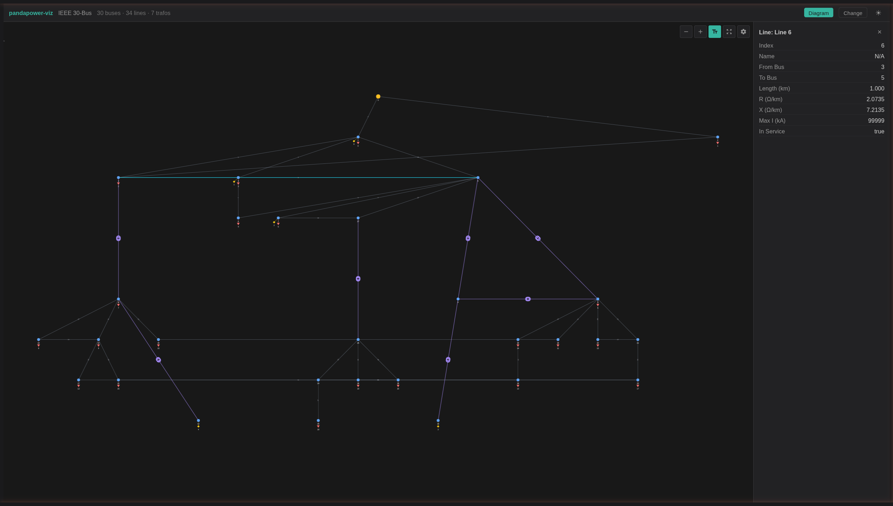

# pandapower-viz

Interactive web visualizer for [pandapower](https://www.pandapower.org/) networks. Render power system diagrams and geographic maps in the browser — from Python or React.



## Features

- **Network Diagram** — Interactive graph visualization with vis-network. Zoom, pan, drag, and click elements to inspect properties.
- **Geographic Map** — Plot buses and lines on OpenStreetMap when coordinates are available.
- **Color Modes** — Color by element type, voltage level, or loading percentage.
- **Compact Mode** — Automatically simplifies large networks (>500 buses) for performance.
- **Dark & Light Themes** — Full theme support via CSS custom properties.
- **Dual Distribution** — Use from Python (`pip install`) or React (`npm install`).
- **Jupyter Support** — Renders inline in notebook cells via anywidget.

## Python Usage

```bash
pip install pandapower-viz
```

```python
import pandapower as pp
import pandapower_viz as pv

net = pp.networks.case_ieee30()
pp.runpp(net)
pv.show(net)  # opens browser at localhost:8050
```

### Jupyter Notebook

`pv.show(net)` auto-detects Jupyter and renders the diagram inline in the cell:

```python
# In a Jupyter notebook cell:
import pandapower as pp
import pandapower_viz as pv

net = pp.networks.case_ieee30()
pp.runpp(net)
pv.show(net)  # renders inline — no browser tab opened
```

You can also use the widget directly for more control:

```python
from pandapower_viz import NetworkWidget

w = NetworkWidget.from_net(net)
display(w)

# Update the network later:
pp.runpp(net)
w.update_network(net)
```

## React Usage

```bash
npm install pandapower-viz
```

```tsx
import { NetworkDiagram, parsePandaPowerJson } from 'pandapower-viz';
import 'pandapower-viz/dist/style.css';

function App({ data }) {
  const network = parsePandaPowerJson(data);
  return (
    <NetworkDiagram
      network={network}
      theme="dark"
      onElementSelect={(el) => console.log(el)}
    />
  );
}
```

### Components

| Component | Description |
|-----------|-------------|
| `NetworkDiagram` | Interactive network graph (vis-network). Supports color modes, compact mode, physics simulation. |
| `NetworkMap` | Geographic map (Leaflet/OpenStreetMap). Shows buses as markers, lines as polylines. |

### Utilities

| Function | Description |
|----------|-------------|
| `parsePandaPowerJson(data)` | Parse pandapower JSON (from `pp.to_json()`) into a typed network object. |
| `convertToVisNetwork(network)` | Convert network to vis-network nodes and edges (detailed mode). |
| `convertToVisNetworkCompact(network)` | Convert to simplified nodes/edges for large networks. |
| `getNetworkStatistics(network)` | Get element counts (buses, lines, trafos, etc.). |
| `extractGeodata(network)` | Extract geographic coordinates from bus data. |
| `getElementInfo(element, network)` | Get detailed properties for a selected element. |
| `calculateTreeLayout(nodes, edges)` | Compute hierarchical tree positions for network nodes. |

### Theming

pandapower-viz uses CSS custom properties prefixed with `--ppviz-`. Override them to match your app's theme:

```css
:root {
  --ppviz-bg-primary: var(--your-bg);
  --ppviz-text-primary: var(--your-text);
  --ppviz-brand-accent: var(--your-accent);
}
```

Or use the `data-ppviz-theme` attribute for built-in dark/light themes:

```html
<div data-ppviz-theme="light">
  <!-- pandapower-viz components here -->
</div>
```

## Supported Elements

Buses, lines, transformers (2-winding), loads, generators, static generators (solar PV, wind), battery storage, switches, external grids.

## Requirements

- **Python**: 3.9+ with pandapower
- **React**: 18+
- **Peer dependencies**: react, react-dom

## Development

```bash
git clone https://github.com/matheusduartedm/pandapower-viz
cd pandapower-viz/frontend
npm install
npm run dev        # start dev server
npm test           # run tests
npm run build-lib  # build npm library
```

## License

MIT
